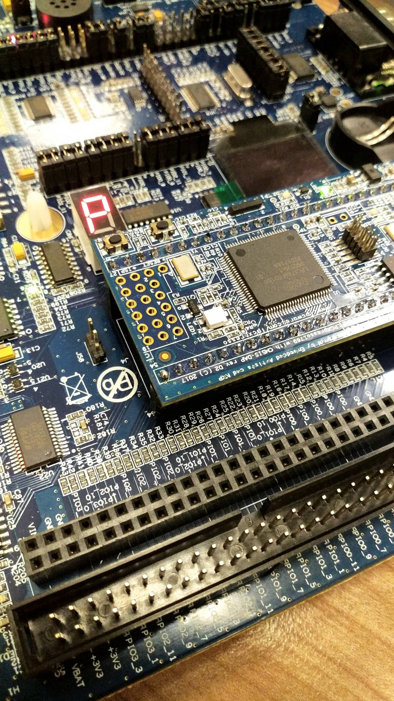
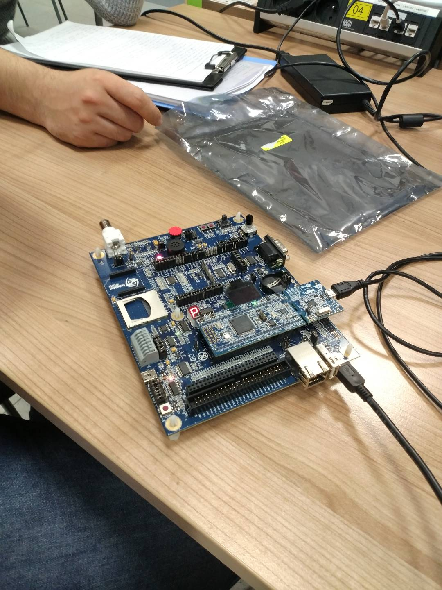

# LPC1769-AlarmClockProject
Project uses the embedded board LPC1769 and it also requires LPCXpresso IDE from NXP to work. 
With this project, LPC1769 board can accomplish the tasks that is listed below:

-Can measure the temperature in Celcius format.

-Can show the current time and date.

-Can detect the movement with board's motion sensor and can be modified for the further use.

-Can set the alarm time using joystick that board has.

-Can play the alarm with custom melody when the alarm time matches with the current time.

-Can stop the alarm with the button when the alarm plays.

-LED lights on the board change colors when the alarm plays.

-Turning the rotary on the board allows user to switch on/off the screen.

This project is final and no additional functions will be added later on. 

